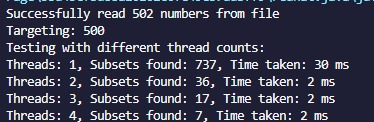

# Sistemas Distribuídos - Processamento Paralelo

## Índice
- [Introdução](#introducao)
- [Estrutura do Código](#estrutura-do-codigo)
- [Funcionamento do Algoritmo](#funcionamento-do-algoritmo)
- [Testes](#testes)
- [Conclusão](#conclusao)
- [Dupla](#dupla)

## Introdução
Este programa tem como objetivo encontrar subconjuntos de um conjunto de números que somem a um valor alvo. A implementação utiliza paralelismo para melhorar a eficiência da busca, dividindo a carga de trabalho entre múltiplas threads.

## Estrutura do Código

### Importação de Bibliotecas
O programa utiliza as seguintes bibliotecas:
- `java.io.*`: Para manipulação de arquivos.
- `java.util.*`: Para manipulação de listas e arrays.
- `java.util.concurrent.*`: Para implementar concorrência e paralelismo.
- `java.util.concurrent.atomic.AtomicInteger`: Para manter a contagem total de subconjuntos encontrados de forma segura em um ambiente multithread.

### Funções Principais

#### 1. `generateRandomTarget()`
Gera um número aleatório entre 100 e 1000 para ser utilizado como soma alvo dos subconjuntos.

#### 2. `readNumbersFromFile(String filePath)`
Lê um conjunto de números de um arquivo e os armazena em um array de inteiros. Os números estão separados por espaço na linha lida do arquivo.

#### 3. `SubsetCounter`
Classe interna que implementa `Callable<Integer>`. Essa classe executa a contagem de subconjuntos em uma região específica do array de números, permitindo a execução concorrente.

O método `countSubsets()` executa a busca recursiva para contar subconjuntos cuja soma seja igual ao valor alvo.

#### 4. `findSubsetCount(int[] numbers, int target, int numThreads)`
Esta função é responsável por dividir o problema entre múltiplas threads:
- Cria um `ExecutorService` com `numThreads` threads.
- Divide o array de números em segmentos para cada thread processar.
- Envia as tarefas para execução concorrente.
- Obtém os resultados das threads e soma os subconjuntos encontrados.
- Implementa um tempo limite de execução para evitar que o cálculo fique preso indefinidamente.

#### 5. `main(String[] args)`
- Lê um dos arquivos de instâncias.
- Gera um valor alvo aleatório.
- Executa o algoritmo variando o número de threads de 1 a 4.
- Mede e imprime o tempo de execução e o número de subconjuntos encontrados para cada configuração de threads.

## Funcionamento do Algoritmo
O algoritmo implementa uma busca exaustiva para encontrar subconjuntos cuja soma seja igual ao valor alvo. Como esse problema pertence à classe NP-completo, a solução ingênua teria complexidade exponencial. Para mitigar esse problema, o programa usa paralelismo para dividir a carga de trabalho entre múltiplas threads.

Cada thread processa um segmento do array de entrada e calcula, de forma independente, a quantidade de subconjuntos dentro de seu intervalo. Os resultados são acumulados de maneira segura usando `AtomicInteger`.

A implementação garante que todas as combinações possíveis sejam testadas, respeitando a ordem dos elementos e garantindo que cada subconjunto seja contado uma única vez.

## Testes 
Foram testadas as seguintes 4 instâncias localizadas na pasta `SD`:
- inst100a.txt - 102 números no arquivo
- inst500a.txt - 502 números no arquivo
- inst1000a.txt - 1002 números no arquivo
- inst5000a.txt - 5002 números no arquivo

### Dicionário
- Target: Elemento alvo das buscas
- Subsets: Subconjuntos válidos
- Threads x: Número de Threads utilizados na busca
- Time Taken: Tempo de busca em Milissegundos

### Primeira instância:

 

### Segunda instância:

### Terceira instância:

### Quarta instância:

Nota: Não houve capacidade de processamento disponível para testes com Targets superiores a 1000 com uma única Thread.

### Time-out diminuído para 60 segundos:

### Últimos testes:
Testes com valores alvo gerados aleatoriamente para uma maior variedade de resultados de forma eficiente.

## Conclusão
O programa utiliza paralelismo para acelerar a busca por subconjuntos que somam a um valor alvo. Apesar de a complexidade do problema ser alta, a divisão da carga entre threads reduz o tempo de execução. No entanto, para conjuntos muito grandes, a abordagem ainda pode ser ineficiente, sendo necessárias técnicas mais avançadas como poda de busca ou programação dinâmica para otimização adicional.

## Dupla
<table align="center">
  <tr align="center">
  <td>
      <a href="https://github.com/Caiqueferlima">
        
        
Caíque  Fernandes

      </a>
    </td>
    <td>
      <a href="https://github.com/RafaelSantosIF">
        
        
Rafael  Santos

      </a>
  </tr>
